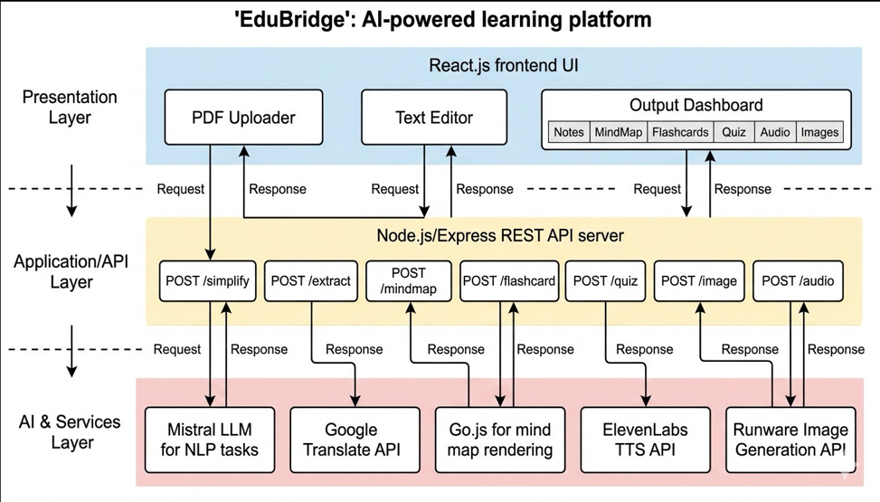

# EduBridge

> **Agentic AI Framework for Inclusive Education** — Making education accessible, simplified, and interactive for every learner.

---

## Overview

EduBridge is an intelligent educational tool that helps students learn better by transforming complex textbook content into simplified, interactive learning materials. Upload a PDF or paste your notes, and let AI do the heavy lifting!

---

## Architecture Diagram



---
## Key Features

| Feature | Description |
|---------|-------------|
| PDF / Text Ingestion | Upload PDFs or paste raw notes for instant processing |
| Topic Extraction | Automatically structures content into topics and subtopics |
| Simplification | Rewrites complex content in simple, approachable language |
| Mind Maps | Visual concept maps with interactive explainer mode |
| Flashcards | Auto-generated study cards with export support |
| MCQ Quizzes | AI-crafted multiple-choice questions with instant feedback |
| Chatbot Tutor | Conversational AI for on-demand concept clarification |
| Audio Explanations | Text-to-speech narration for auditory learners |
| Video Explanations | AI-generated video breakdowns of topics |
| Translation | Multi-language support for regional accessibility |
| Insights | Learning analytics and performance tracking |
| Image Analysis | Visual content processing and explanation |
| Export | Export sessions as PDF documents |
| Stylometry | Writing style analysis capabilities |

---

## Project Structure

```text
EDUBRIDGE-FINAL/
│
├── backend/                             # Flask REST API
│   ├── routes/                          # API endpoint definitions
│   │   ├── audio_routes.py
│   │   ├── chatbot_routes.py
│   │   ├── export_routes.py
│   │   ├── flashcard_routes.py
│   │   ├── image_routes.py
│   │   ├── insights_routes.py
│   │   ├── mcq_routes.py
│   │   ├── mindmap_explain_routes.py
│   │   ├── mindmap_routes.py
│   │   ├── pdf_routes.py
│   │   ├── quiz_routes.py
│   │   ├── simplify_routes.py
│   │   ├── text_routes.py
│   │   ├── translation_routes.py
│   │   └── video_routes.py
│   │
│   ├── services/                        # Core business logic
│   │   ├── audio_service.py
│   │   ├── chatbot_service.py
│   │   ├── explain_service.py
│   │   ├── flashcard_service.py
│   │   ├── image_service.py
│   │   ├── insights_service.py
│   │   ├── local_llm_service.py
│   │   ├── mindmap_explain_service.py
│   │   ├── mindmap_service.py
│   │   ├── quiz_service.py
│   │   ├── simplify_service.py
│   │   ├── stylometry_service.py
│   │   ├── text_service.py
│   │   ├── translation_service.py
│   │   └── video_service.py
│   │
│   ├── utils/                           # Shared utilities
│   │   ├── gemini_client.py             # Gemini AI model configuration
│   │   └── response_formatter.py        # Standardized API response formatting
│   │
│   ├── uploads/                         # Uploaded files (runtime, git-ignored)
│   ├── app.py                           # Flask application entry point
│   ├── requirements.txt                 # Python dependencies
│   ├── .env                             # Environment variables (not committed)
│   └── .gitignore
│
├── frontend/                            # React + Vite application
│   ├── src/
│   │   ├── assets/                      # Static assets (SVGs, images)
│   │   │
│   │   ├── components/
│   │   │   ├── output/                  # Feature output modals
│   │   │   │   ├── ChatbotModal.jsx
│   │   │   │   ├── ContentPanel.jsx
│   │   │   │   ├── FlashcardModal.jsx
│   │   │   │   ├── ImagesModal.jsx
│   │   │   │   ├── InsightsModal.jsx
│   │   │   │   ├── MCQ.jsx
│   │   │   │   ├── MindmapModal.jsx
│   │   │   │   ├── QuizModal.jsx
│   │   │   │   ├── Studio.jsx
│   │   │   │   ├── TopicsSidebar.jsx
│   │   │   │   └── VideoModal.jsx
│   │   │   ├── Navbar.jsx
│   │   │   ├── quiz_game.js
│   │   │   └── Sidebar.jsx
│   │   │
│   │   ├── hooks/
│   │   │   └── useExportPDF.js
│   │   │
│   │   ├── pages/
│   │   │   ├── About.jsx
│   │   │   ├── History.jsx
│   │   │   ├── Home.jsx
│   │   │   └── Output.jsx
│   │   │
│   │   ├── services/
│   │   │   └── api.js                   # Axios API client
│   │   │
│   │   ├── App.jsx
│   │   ├── App.css
│   │   ├── index.css
│   │   └── main.jsx
│   │
│   ├── public/
│   ├── index.html
│   ├── package.json
│   ├── package-lock.json
│   ├── vite.config.js
│   ├── eslint.config.js
│   ├── .env                             # Environment variables (not committed)
│   └── .gitignore
│
├── docs/                                # Documentation assets
│   └── architecture.png                 # Architecture diagram (add your image here)
│
├── README.md
└── .gitignore
```

---
## Tech Stack

### **Backend**
- **Framework:** Flask
- **AI Models:**
  - Google Vertex AI with fine-tuned Gemini 2.5 Flash
- **PDF Processing:** PyMuPDF (fitz) - for extracting text from PDFs
- **API Architecture:** RESTful API with Blueprints
- **CORS:** Flask-CORS for cross-origin requests
- **Environment:** python-dotenv for configuration

### **Frontend**
- **Framework:** React 18
- **Build Tool:** Vite
- **Styling:** Tailwind CSS
- **HTTP Client:** Axios (API requests)
- **Icons:** Lucide React (icon library)
- **Routing:** React Router v6 (page navigation)
- **State Management:** React Hooks (useState, useRef)

## Getting Started

### Prerequisites
Before you start, make sure you have:
- **Python 3.8+** - [Download](https://www.python.org/)
- **Node.js 16+** - [Download](https://nodejs.org/)
- **Git** - [Download](https://git-scm.com/)
- **Google Generative AI API Key** - [Get it here](https://makersuite.google.com/app/apikey)

## Backend Setup

### Step 1: Navigate to Backend
```bash
cd backend
```

### Step 2: Create Virtual Environment
```bash
# Windows
python -m venv venv
venv\Scripts\activate

# macOS/Linux
python3 -m venv venv
source venv/bin/activate
```

### Step 3: Install Dependencies
```bash
pip install -r requirements.txt
```

### Step 4: Create Environment Configuration
Create a `.env` file in the `backend` folder.

### Step 5: Run Backend Server
```bash
python app.py
```

✅ Backend runs on: **http://localhost:5000**

---

## Frontend Setup

### Step 1: Navigate to Frontend (in a new terminal)
```bash
cd frontend
```

### Step 2: Install Dependencies
```bash
npm install
```

### Step 3: Create Environment Configuration
Create a `.env` file in the `frontend` folder:

### Step 4: Run Development Server
```bash
npm run dev
```

✅ Frontend runs on: **http://localhost:5173**

## How to Use EduBridge

1. **Open the app** → Go to http://localhost:5173
2. **Input Content** →
   - Paste text directly in the textarea, OR
   - Upload a PDF file
3. **Click Process** → Wait for AI to extract and organize content
4. **Choose Service** →
   - **Extract Topics** - See organized content structure
   - **Simplify** - Get child-friendly version
   - **Mind Map** - Visualize concept relationships
   - **Flashcards** - Study with interactive cards
5. **Learn!** → Start studying with your personalized materials

---

## Quick Commands Reference

### Start Both Services (Recommended: Use 2 terminals)

**Terminal 1 - Backend:**
```bash
cd backend
venv\Scripts\activate  # or: source venv/bin/activate
python app.py
```

**Terminal 2 - Frontend:**
```bash
cd frontend
npm run dev
```

### View the App
Open your browser and go to: **http://localhost:5173**

---
#
